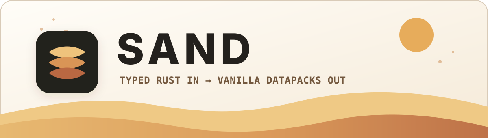

<div align="center">
  <picture>
    <source media="(prefers-color-scheme: dark)" srcset="assets/readme/sand-header-dark.svg">
    <source media="(prefers-color-scheme: light)" srcset="assets/readme/sand-header-light.svg">
    
  </picture>
</div>

<p align="center">
  <strong>A strongly typed Rust framework for building vanilla Minecraft Java datapacks.</strong>
</p>

<p align="center">
  <a href="https://github.com/ThatOneToast/sand/actions/workflows/rust.yml"></a>
  <a href="#minecraft-versions"></a>
  <a href="#stability"></a>
  <a href="LICENSE"></a>
</p>

<p align="center">
  <a href="#why-sand">Why Sand</a> ·
  <a href="#quick-start">Quick start</a> ·
  <a href="#what-you-can-build">Features</a> ·
  <a href="book/src/introduction.md">Guide</a> ·
  <a href="examples/README.md">Examples</a>
</p>

## Why Sand?

Datapacks are a great **distribution format**: portable, server-native, and
made from ordinary files that Minecraft already understands. At scale, they
become a cumbersome **authoring format**: command strings, JSON resources,
scoreboard conventions, version differences, and cross-file wiring all have to
stay in sync by hand.

Sand moves that work into Rust. You author against typed commands, state,
conditions, resource identifiers, and version profiles; Sand exports a normal
datapack under `data/<namespace>/...`.

**Typed Rust in. Vanilla datapacks out. No mod required.**

```rust
use sand::prelude::*;

static DISCOVERIES: ScoreVar<i32> = ScoreVar::new("discoveries");

#[component(Load)]
pub fn load() {
    DISCOVERIES.define();
}

#[function]
pub fn discover_oasis() {
    DISCOVERIES.add(Selector::self_(), 1);
    cmd::tellraw(
        Selector::self_(),
        Text::new("Oasis discovered!").gold().bold(true),
    );
}
```

`#[component(Load)]` wires `load` into Minecraft's `load` function tag.
`#[function]` exports `discover_oasis` as a callable function. The result is
still the vanilla format you would ship without Sand:

```text
dist/oasis/
├── pack.mcmeta
└── data/
    ├── minecraft/tags/function/load.json
    └── oasis/function/
        ├── discover_oasis.mcfunction
        └── load.mcfunction
```

```mcfunction
# data/oasis/function/discover_oasis.mcfunction
scoreboard players add @s discoveries 1
tellraw @s {"bold":true,"color":"gold","text":"Oasis discovered!"}
```

Keep the generated files, inspect them, zip them, or copy them directly into a
world's `datapacks/` directory. Sand is an authoring tool and build pipeline,
not a runtime dependency.

## What you can build

### Framework

- **Attribute-first packs** — export functions and lifecycle hooks with
  `#[function]`, `#[component(Load)]`, and `#[component(Tick)]`.
- **Typed commands and control flow** — selectors, text, execute chains,
  conditions, particles, sounds, scoreboards, NBT operations, and generated
  command builders.
- **Typed state** — `ScoreVar`, `Flag`, `Timer`, `Cooldown`, storage schemas,
  and entity-bound state replace ad hoc objective and path conventions.
- **Data-driven resources** — builders for recipes, advancements, predicates,
  loot tables, item modifiers, tags, dialogs, enchantments, and more.
  Coverage varies by resource; explicit raw JSON, SNBT, component, and command
  escape hatches remain available for unsupported edges.
- **Version-aware output** — version profiles gate known features and generated
  registries against the selected Minecraft target.
- **Optional systems** — feature-gated building blocks for damage, cooldowns,
  lifecycle, player data, movement, inventory, and entities.
- **Optional resource packs** — generate HUD and resource-pack output alongside
  a datapack when the `resourcepack` feature is enabled.

### CLI

- `sand new` and `sand init` scaffold an attribute-first project.
- `sand build` compiles deterministic output into `dist/`; `--release` also
  creates a distributable zip.
- `sand run` builds the pack, prepares a local Minecraft server, and presents
  classified, verbose, raw, or JSON server logs.
- `sand add resourcepack` adds the optional resource-pack export setup.
- `sand join` integrates with Prism Launcher for local testing.
- `sand clean` removes generated pack and optional server/build artifacts.

Run `sand --help` for the complete command reference.

## Quick start

Sand is not published to crates.io yet. Install the CLI from a clone:

```sh
git clone https://github.com/ThatOneToast/sand.git
cd sand
cargo install --path sand-cli
```

Then scaffold and build a pack:

```sh
sand new oasis --mc-version 26.2
cd oasis
sand build
```

The scaffold uses the `sand` façade crate for authoring and `sand-build` for
export:

```toml
[dependencies]
sand = { git = "https://github.com/ThatOneToast/sand.git", branch = "main" }

[build-dependencies]
sand-build = { git = "https://github.com/ThatOneToast/sand.git", branch = "main" }
```

Because `main` moves quickly, pin both dependencies to the same Git revision
when you need a reproducible project.

## Minecraft versions

- **26.2** is the canonical export profile and the target used by current
  examples and generated APIs.
- **1.21.4** is the oldest explicit compatibility boundary exercised by CI; it
  is not the default.
- Unknown or future version strings resolve to conservative capabilities.
  Use `VersionProfile::resolve_strict()` when an unsupported target should be
  a hard error.

Minecraft Java version support is profile-aware rather than a promise that
every resource field or advancement trigger has identical typed coverage.
Consult the [version support reference](book/src/reference/version-support.md)
and resource-specific API documentation when targeting an edge case.

## Stability

> [!IMPORTANT]
> **Sand is alpha software.** The public API can change between commits, and
> removed APIs do not receive compatibility shims. Pin a known-good Git
> revision for projects that need stability.

The attribute-first authoring model, typed state and conditions, typed text and
execute chains, command builders, and scaffolding are the firmest parts of the
project today. Events, dialogs, and resource-pack generation are alpha.
`mcfunction!` and registry coverage for unreleased Minecraft versions are
experimental.

Sand produces vanilla files, but successful Rust compilation alone does not
prove that every gameplay path behaves as intended. Inspect generated output
and test serious packs with a vanilla server before release.

## Learn and contribute

- [Sand Guide](book/src/introduction.md) — installation, authoring, debugging,
  packaging, and reference material.
- [Trailforge example](examples/book_project/src/lib.rs) — a complete pack with
  state, items, recipes, events, dialogs, conditions, and effects.
- [Examples index](examples/README.md) — focused examples and standalone pack
  projects.
- [Architecture](docs/architecture/adr-001-crate-boundaries.md) — public
  façade, implementation crates, and dependency boundaries.
- [Contributing](CONTRIBUTING.md) — toolchain policy and validation commands.
- [Roadmap](ROADMAP.md) — future work and explicitly unfinished areas.

Sand is available under the [MIT License](LICENSE).

<sub>Sand is an independent project and is not affiliated with or endorsed by
Mojang Studios or Microsoft.</sub>
